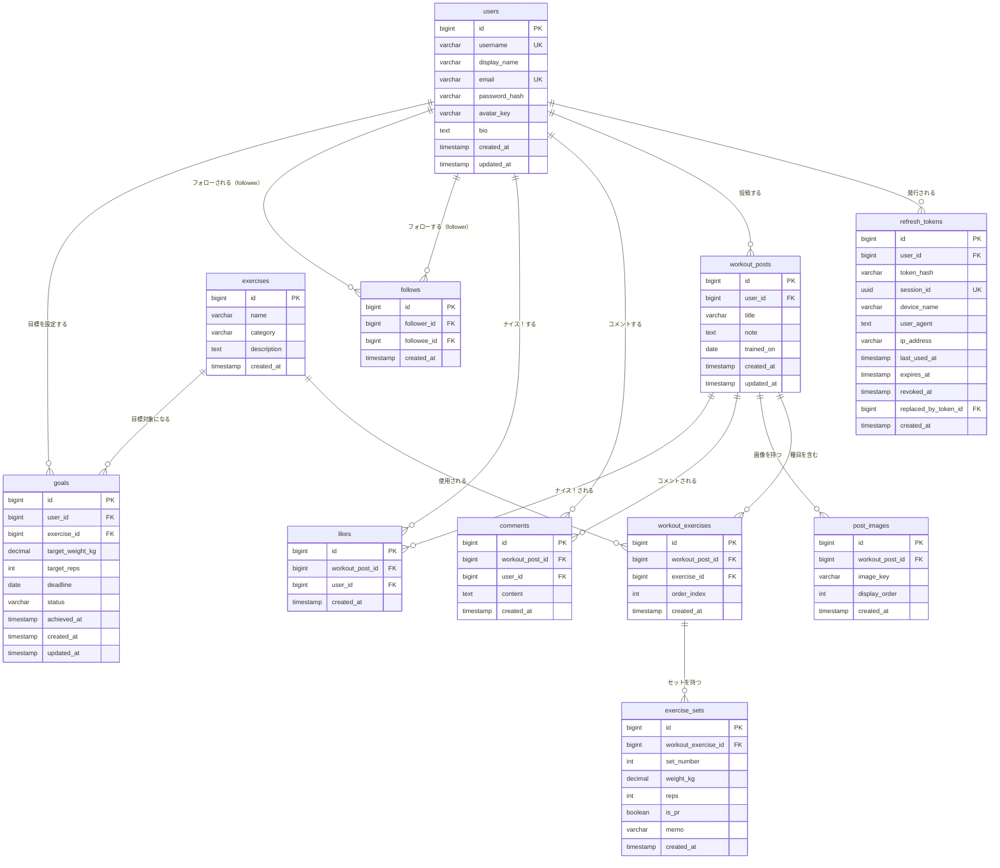

# データベース設計

## 1. ER 図

---

## 2. テーブル定義

### 2-1. users（ユーザー）

| カラム名 | 型 | 制約 | 備考 |
|---|---|---|---|
| id | BIGSERIAL | PRIMARY KEY | |
| username | VARCHAR(20) | NOT NULL, UNIQUE | 英数字とアンダースコアのみ |
| display_name | VARCHAR(50) | NOT NULL | 表示名 |
| email | VARCHAR(255) | NOT NULL, UNIQUE | |
| password_hash | VARCHAR(255) | NOT NULL | bcrypt ハッシュ（saltRounds=12） |
| avatar_key | VARCHAR(500) | NULL | S3 object key（例: `images/avatars/10/uuid.jpg`） |
| bio | TEXT | NULL | 自己紹介（160 文字以内） |
| created_at | TIMESTAMP | NOT NULL, DEFAULT NOW() | |
| updated_at | TIMESTAMP | NOT NULL, DEFAULT NOW() | |

**インデックス:**
- `idx_users_username` ON `users(username)`

---

### 2-2. refresh_tokens（リフレッシュトークン）

| カラム名 | 型 | 制約 | 備考 |
|---|---|---|---|
| id | BIGSERIAL | PRIMARY KEY | |
| user_id | BIGINT | NOT NULL, FOREIGN KEY → users(id) | ON DELETE CASCADE |
| token_hash | VARCHAR(255) | NOT NULL | クライアントの生トークンを SHA-256 ハッシュ化した値 |
| session_id | UUID | NOT NULL, UNIQUE | 端末（セッション）単位の識別子 |
| device_name | VARCHAR(100) | NULL | 端末名（クライアント自己申告） |
| user_agent | TEXT | NOT NULL | リクエストUA |
| ip_address | VARCHAR(45) | NOT NULL | ログイン/更新時IP（IPv6対応） |
| last_used_at | TIMESTAMP | NOT NULL, DEFAULT NOW() | 最終利用日時 |
| expires_at | TIMESTAMP | NOT NULL | 有効期限（発行から 7 日） |
| revoked_at | TIMESTAMP | NULL | 無効化日時（トークンローテーション時に設定） |
| replaced_by_token_id | BIGINT | NULL, FOREIGN KEY → refresh_tokens(id) | ローテーション後続トークン |
| created_at | TIMESTAMP | NOT NULL, DEFAULT NOW() | |

**インデックス:**
- `idx_refresh_tokens_user_id` ON `refresh_tokens(user_id)`
- `idx_refresh_tokens_token_hash` ON `refresh_tokens(token_hash)`
- `idx_refresh_tokens_user_revoked_expires` ON `refresh_tokens(user_id, revoked_at, expires_at)`
- `idx_refresh_tokens_session_revoked` ON `refresh_tokens(session_id, revoked_at)`

---

### 2-3. exercises（種目マスタ）

| カラム名 | 型 | 制約 | 備考 |
|---|---|---|---|
| id | BIGSERIAL | PRIMARY KEY | |
| name | VARCHAR(100) | NOT NULL | 種目名（例: ベンチプレス） |
| category | VARCHAR(50) | NOT NULL | 部位カテゴリ（胸・背中・脚・肩・腕・体幹）|
| description | TEXT | NULL | 種目の説明・フォームのポイント |
| created_at | TIMESTAMP | NOT NULL, DEFAULT NOW() | |

---

### 2-4. workout_posts（トレーニング投稿）

| カラム名 | 型 | 制約 | 備考 |
|---|---|---|---|
| id | BIGSERIAL | PRIMARY KEY | |
| user_id | BIGINT | NOT NULL, FOREIGN KEY → users(id) | ON DELETE CASCADE |
| title | VARCHAR(100) | NOT NULL | 投稿タイトル（例: 胸の日） |
| note | TEXT | NULL | 全体メモ（500 文字以内） |
| trained_on | DATE | NOT NULL | トレーニング実施日 |
| created_at | TIMESTAMP | NOT NULL, DEFAULT NOW() | |
| updated_at | TIMESTAMP | NULL | 編集時に更新（未編集は NULL） |

**インデックス:**
- `idx_workout_posts_user_id` ON `workout_posts(user_id)`
- `idx_workout_posts_trained_on` ON `workout_posts(trained_on DESC)`
- `idx_workout_posts_created_at` ON `workout_posts(created_at DESC)` ← タイムライン取得用

---

### 2-5. workout_exercises（投稿内の種目）

| カラム名 | 型 | 制約 | 備考 |
|---|---|---|---|
| id | BIGSERIAL | PRIMARY KEY | |
| workout_post_id | BIGINT | NOT NULL, FOREIGN KEY → workout_posts(id) | ON DELETE CASCADE |
| exercise_id | BIGINT | NOT NULL, FOREIGN KEY → exercises(id) | |
| order_index | INT | NOT NULL | 表示順序（0 始まり） |
| created_at | TIMESTAMP | NOT NULL, DEFAULT NOW() | |

**インデックス:**
- `idx_workout_exercises_post_id` ON `workout_exercises(workout_post_id)`

---

### 2-6. exercise_sets（セット記録）

| カラム名 | 型 | 制約 | 備考 |
|---|---|---|---|
| id | BIGSERIAL | PRIMARY KEY | |
| workout_exercise_id | BIGINT | NOT NULL, FOREIGN KEY → workout_exercises(id) | ON DELETE CASCADE |
| set_number | INT | NOT NULL | セット番号（1 始まり） |
| weight_kg | DECIMAL(6,2) | NOT NULL | 重量（kg）。自重は 0 |
| reps | INT | NOT NULL | 回数 |
| is_pr | BOOLEAN | NOT NULL, DEFAULT FALSE | 個人記録（Personal Record）フラグ |
| memo | VARCHAR(200) | NULL | セット単位のメモ（例: 「PR感覚」「きつかった」） |
| created_at | TIMESTAMP | NOT NULL, DEFAULT NOW() | |

**インデックス:**
- `idx_exercise_sets_workout_exercise_id` ON `exercise_sets(workout_exercise_id)`

---

### 2-7. post_images（投稿画像）

| カラム名 | 型 | 制約 | 備考 |
|---|---|---|---|
| id | BIGSERIAL | PRIMARY KEY | |
| workout_post_id | BIGINT | NOT NULL, FOREIGN KEY → workout_posts(id) | ON DELETE CASCADE |
| image_key | VARCHAR(500) | NOT NULL | S3 object key（例: `images/posts/123/uuid.jpg`）URL は保存しない |
| display_order | INT | NOT NULL | 表示順序（0〜3） |
| created_at | TIMESTAMP | NOT NULL, DEFAULT NOW() | |

**インデックス:**
- `idx_post_images_workout_post_id` ON `post_images(workout_post_id)`

---

### 2-8. comments（コメント）

| カラム名 | 型 | 制約 | 備考 |
|---|---|---|---|
| id | BIGSERIAL | PRIMARY KEY | |
| workout_post_id | BIGINT | NOT NULL, FOREIGN KEY → workout_posts(id) | ON DELETE CASCADE |
| user_id | BIGINT | NOT NULL, FOREIGN KEY → users(id) | ON DELETE CASCADE |
| content | TEXT | NOT NULL | コメントテキスト（アプリ側で最大文字数をバリデーション） |
| created_at | TIMESTAMP | NOT NULL, DEFAULT NOW() | |

**インデックス:**
- `idx_comments_workout_post_id` ON `comments(workout_post_id)`

---

### 2-9. likes（ナイス！）

| カラム名 | 型 | 制約 | 備考 |
|---|---|---|---|
| id | BIGSERIAL | PRIMARY KEY | |
| workout_post_id | BIGINT | NOT NULL, FOREIGN KEY → workout_posts(id) | ON DELETE CASCADE |
| user_id | BIGINT | NOT NULL, FOREIGN KEY → users(id) | ON DELETE CASCADE |
| created_at | TIMESTAMP | NOT NULL, DEFAULT NOW() | |

**制約:**
- UNIQUE(`workout_post_id`, `user_id`) ← 同一ユーザーの二重ナイス防止

**インデックス:**
- `idx_likes_workout_post_id` ON `likes(workout_post_id)`
- `idx_likes_user_id` ON `likes(user_id)`

---

### 2-10. follows（フォロー）

| カラム名 | 型 | 制約 | 備考 |
|---|---|---|---|
| id | BIGSERIAL | PRIMARY KEY | |
| follower_id | BIGINT | NOT NULL, FOREIGN KEY → users(id) | フォローするユーザー、ON DELETE CASCADE |
| followee_id | BIGINT | NOT NULL, FOREIGN KEY → users(id) | フォローされるユーザー、ON DELETE CASCADE |
| created_at | TIMESTAMP | NOT NULL, DEFAULT NOW() | |

**制約:**
- UNIQUE(`follower_id`, `followee_id`) ← 同一ユーザーへの二重フォロー防止
- CHECK(`follower_id <> followee_id`) ← 自己フォロー防止

**インデックス:**
- `idx_follows_follower_id` ON `follows(follower_id)`
- `idx_follows_followee_id` ON `follows(followee_id)`

---

### 2-11. goals（目標設定）

| カラム名 | 型 | 制約 | 備考 |
|---|---|---|---|
| id | BIGSERIAL | PRIMARY KEY | |
| user_id | BIGINT | NOT NULL, FOREIGN KEY → users(id) | ON DELETE CASCADE |
| exercise_id | BIGINT | NOT NULL, FOREIGN KEY → exercises(id) | |
| target_weight_kg | DECIMAL(6,2) | NULL | 目標重量（kg） |
| target_reps | INT | NULL | 目標回数 |
| deadline | DATE | NULL | 達成期限 |
| status | VARCHAR(20) | NOT NULL, DEFAULT 'IN_PROGRESS' | IN_PROGRESS / ACHIEVED / ABANDONED |
| achieved_at | TIMESTAMP | NULL | 達成日時（status=ACHIEVED 時に設定） |
| created_at | TIMESTAMP | NOT NULL, DEFAULT NOW() | |
| updated_at | TIMESTAMP | NOT NULL, DEFAULT NOW() | |

**インデックス:**
- `idx_goals_user_id` ON `goals(user_id)`

---

## 3. リレーション一覧

| リレーション | 種別 | 説明 |
|---|---|---|
| users → workout_posts | 1:N | 1 ユーザーが複数の投稿を持つ |
| users → refresh_tokens | 1:N | 1 ユーザーが複数のリフレッシュトークンを持つ |
| users → comments | 1:N | 1 ユーザーが複数のコメントを持つ |
| users → likes | 1:N | 1 ユーザーが複数の投稿にナイスできる |
| users → goals | 1:N | 1 ユーザーが複数の目標を持つ |
| users ↔ users（follows） | N:M | ユーザー間のフォロー関係（自己参照） |
| workout_posts → workout_exercises | 1:N | 1 投稿に複数の種目を含む |
| workout_posts → post_images | 1:N | 1 投稿に最大 4 枚の画像を持つ |
| workout_posts → comments | 1:N | 1 投稿に複数のコメントが付く |
| workout_posts → likes | 1:N | 1 投稿に複数のナイスが付く |
| workout_exercises → exercise_sets | 1:N | 1 種目に複数のセット記録を持つ |
| exercises → workout_exercises | 1:N | 1 種目マスタが複数の投稿種目で使用される |
| exercises → goals | 1:N | 1 種目マスタが複数の目標の対象になる |
